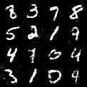

# Generative Adversarial Network (GAN) for Synthetic MNIST Images


## Overview
I trained a GAN to generate synthetic images resembling the MNIST dataset. The generator creates new images from random noise, while the discriminator attempts to distinguish real MNIST images from those generated.

## Core Concepts

### 1. Objectives of a GAN
- **Generator (G)**: Produces fake data (e.g., images).  
- **Discriminator (D)**: Estimates whether data is real or generated (fake).  
- Both components compete:  
  - The generator tries to fool the discriminator.  
  - The discriminator tries to correctly classify real vs. fake data.

### 2. Probability
- The discriminator’s output is a **probability** (close to 1 for real data, close to 0 for fake data).

### 3. Loss Functions
1. **Discriminator’s Loss**  
   ```math
   L_D = -E[\log(D(x))] - E[\log(1 - D(G(z)))]
   ```
   - This measures how well D classifies real data as real and fake data as fake.

2. **Generator’s Loss**  
   ```math
   L_G = -E[\log(D(G(z)))]
   ```
   - This measures how effectively G fools D into classifying generated data as real.

3. **Gradient Descent**  
   - Both G and D update their parameters via gradient descent, adjusting weights to minimize (for G) or maximize (for D) these loss functions.

### 4. Minimax Optimization
GAN training is structured as a **min-max game**:
```math
\min_G \max_D V(D, G) = E[\log(D(x))] + E[\log(1 - D(G(z)))]
```
- G tries to minimize this value, improving generated outputs until they appear real.
- D tries to maximize it, improving its classification of real vs. fake data.

### 5. Drawbacks
- G and D must stay balanced; if one overpowers the other, training becomes unstable (e.g., **vanishing gradient** problem).
- Careful tuning of hyperparameters is required to ensure steady learning for both G and D.

## Summary of Steps
1. Feed real and generated data to the discriminator.  
2. Compute the discriminator’s loss and update its weights.  
3. Generate fake data from random noise and compute the generator’s loss.  
4. Update the generator’s weights.  
5. Repeat until the generator produces images that closely resemble the real MNIST data.
